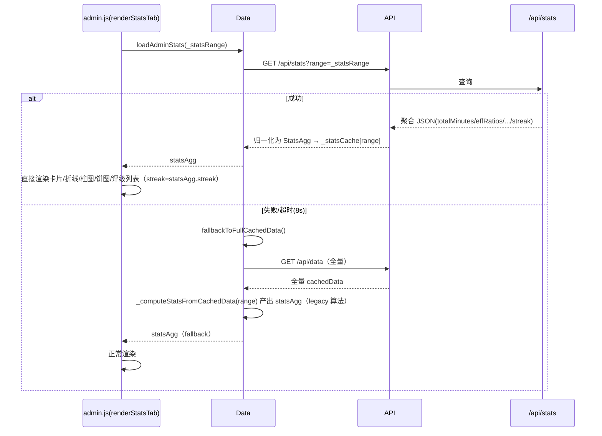
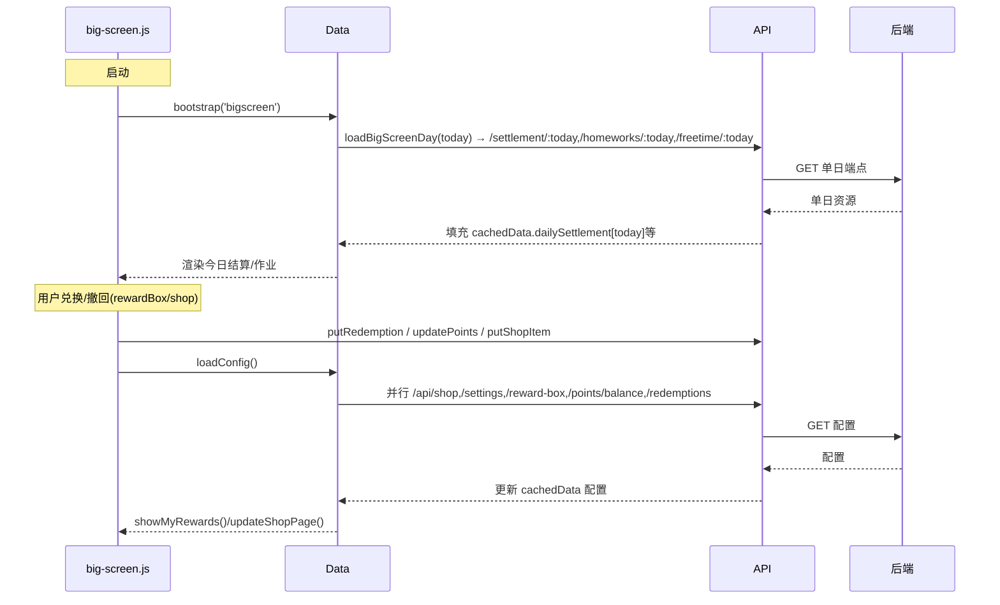
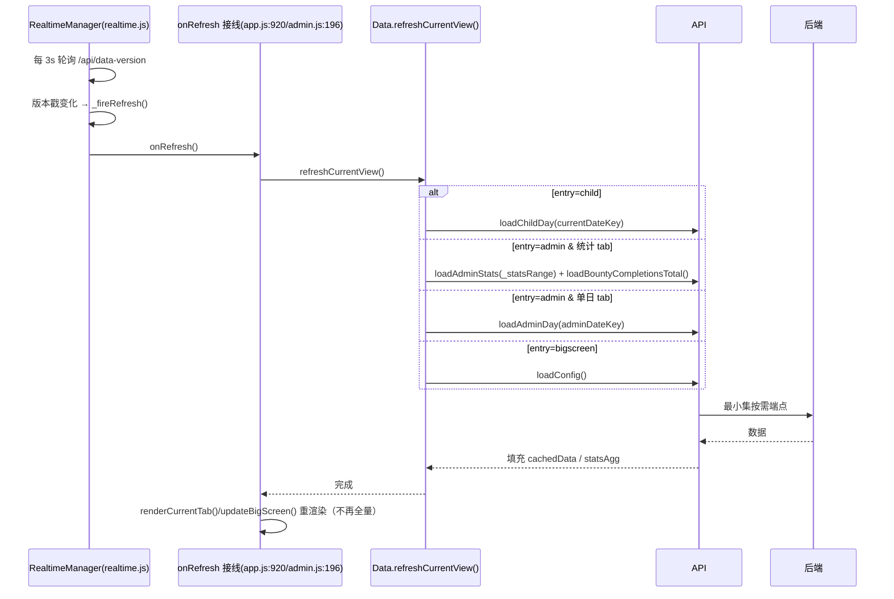
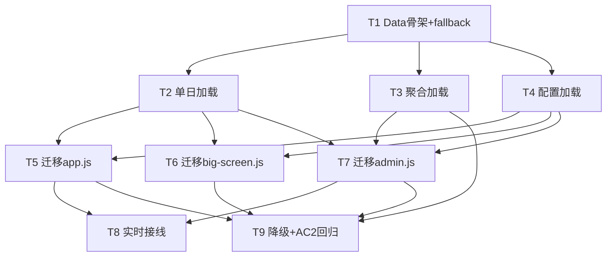

# 前端数据按需获取（重构）系统架构设计 + 任务分解

> **文档元信息**
> - 项目：PapaCheck（前端按需获取重构，纯前端重做，零后端改动）
> - 作者：高见远（软件架构师 / software-architect）
> - 日期：2026-07-19
> - 基线：`main` 分支 tip `81b0de4`，工作树干净
> - 主输入：增量 PRD `deliverables/fe-ondemand-prd-2026-07-19.md`、需求稿 `docs/requirement-data-on-demand.md`、已部署后端端点契约、前端源码（app.js / admin.js / big-screen.js / api.js / realtime.js）
> - 配套检索记录：本档所有结论均基于实际 `sed`/`grep`/`Read` 取证，关键行号见正文。

---

## 1. 实现方案 + 技术选型

### 1.1 技术难点与决策

| 难点 | 决策 | 理由 |
|---|---|---|
| 首屏/单日数据随历史天数膨胀（AC-1） | 新增 `Data` 层，单日/聚合/配置三类按需端点替代全量 `/api/data` | 后端按需端点已部署；前端仅换调用方 |
| 跨天统计必须在客户端遍历全量历史（AC-2 失败根因） | 统计页改消费 `Data.loadAdminStats(range)` 返回的**服务端聚合对象**，不再读 `cachedData.dailySettlement/homeworks` | PRD Q1：服务端 `/api/stats` 已覆盖全部跨天指标，效率比服务端现场算，口径一致 |
| 赏金历史统计口径（AC-2 关键风险） | 直接取 `/api/bounty-completions/total`（等价于现状 `adminBountyCompletions._total`） | **已实测确认**（见 §5 风险裁决），无需客户端逐日聚合 |
| 实时刷新全量重拉（AC-4） | 保留 `/api/data-version` 轮询；回调改调 `Data.refreshCurrentView()` 按视图重拉最小集 | PRD Q5 |
| 降级保底（AC-5） | 任一按需端点失败/超时 → `fallbackToFullCachedData()` 回退 `/api/data` 全量 | PRD Q6；fallback 后 `renderStatsTab` 仍须经 legacy 聚合器产出 statsAgg 才能渲染 |

### 1.2 技术选型

- **原生 JavaScript（classic script，无构建步骤）**，与现有 `PapaCheck.Web/js` 风格完全一致。新增 `data-layer.js` 以 `<script>` 在 app.js / admin.js / big-screen.js **之前**引入，挂全局 `window.Data`。
- **零新依赖**：所有按需端点复用 `api.js` 现有 `API` 封装（`API.getHomeworks` / `getSettlement` / `getFreeTime` / `getBountySubmissions` / `getBountyCompletions` / `getDataVersion` 等）；仅 `api.js` 需**新增 1 个薄封装** `API.getPointsBalance()`（见 §2、§8）。
- **`cachedData` 内存快照形状保持不变**（PRD Q7）：单日/配置类消费点契约零改动，Data 层只负责按视图填充 `cachedData[field][dateKey]`；**唯一必要消费点迁移**是 `renderStatsTab` + `calcStreak`，改消费 `statsAgg` 聚合对象。
- **架构模式**：全局单例 `Data` 服务 + 模块级全局 `cachedData` 快照（沿用现有范式，不引入框架/状态库）。

---

## 2. 文件列表及相对路径

| 文件（相对 `PapaCheck.Web/`） | 改动性质 | 说明 |
|---|---|---|
| `js/data-layer.js` | **新增** | Data 层单例：全部按需端点调用、cachedData 填充、statsAgg 归一化、降级。挂 `window.Data`。 |
| `js/api.js` | **小改** | 新增 `getPointsBalance()`（→ `GET /api/points/balance`）；其余复用。不改现有方法。 |
| `js/app.js` | **改调用** | 3 处 `API.getData()`（220/836/882）→ Data 方法；`onRefresh` 接线（920）→ `Data.refreshCurrentView()`。不改 HTML/CSS、不改业务规则。 |
| `js/admin.js` | **改调用+局部重构** | `refreshAllData`（220）→ `Data.refreshCurrentView()`；`renderStatsTab`（1775）→ 消费 `statsAgg`；`historyCounts`（1073）改读 `Data.getBountyTotal()`；移除 `_applyCachedData` 内的 `migrateBountyCompletionsToTotal`；`onRefresh`（196）→ `Data.refreshCurrentView()`。 |
| `js/big-screen.js` | **改调用** | 3 处 `API.getData()`（1114/1149/1260）→ `Data.loadConfig()`。 |
| `realtime.js` | **不改** | `RealtimeManager` 轮询逻辑不变，仅消费端 `onRefresh` 接线改调 Data 层（见上）。 |

> 注：HTML/CSS、CloudBase 合并、`child` 竖屏、移动端适配**一律不触碰**（见 §9 冲突解决）。

---

## 3. Data 全局对象方法签名、cachedData 填充形状、聚合对象形状

### 3.1 `Data` 全局对象方法签名

```js
// 初始化（替代各端 init 的 await API.getData()）
Data.bootstrap(entry /* 'child'|'admin'|'bigscreen' */, opts) -> Promise<void>

// 单日 / 点状资源
Data.loadChildDay(dateKey)      -> Promise<void>  // → /api/homeworks/:d + /api/settlement/:d + /api/freetime/:d + /api/bounty-submissions/:d
Data.loadAdminDay(dateKey)      -> Promise<void>  // → /api/bounty-submissions/:d + /api/homeworks/:d
Data.loadBigScreenDay(dateKey)  -> Promise<void>  // → /api/settlement/:d + /api/homeworks/:d + /api/freetime/:d（复用 loadChildDay 子集）

// 聚合资源
Data.loadAdminStats(range)      -> Promise<StatsAgg>  // → /api/stats?range= + 归一化为 statsAgg；写入 _statsCache[range]
Data.loadBountyCompletionsTotal()-> Promise<Object>   // → /api/bounty-completions/total；写入 _bountyTotal 与 cachedData.bountyCompletions._total

// 配置资源（并行 6~7 个端点，一次性）
Data.loadConfig()               -> Promise<void>  // → /api/shop,/settings,/reward-box,/bounty-tasks,/active-buffs,/points/balance,[/redemptions]

// 实时刷新（最小集，替代 refreshFromServer/refreshAllData 内的全量重拉）
Data.refreshCurrentView()       -> Promise<void>  // 依据 entry + 当前视图重拉最小集（见 §3.4）

// 降级
Data.fallbackToFullCachedData() -> Promise<void>  // 任一按需端点失败 → GET /api/data 填 cachedData 全量 + 重算 statsAgg/_bountyTotal

// 快照访问（契约不变）与聚合访问
Data.getSnapshot()              -> cachedData
Data.getStats(range)            -> StatsAgg | null   // 返回 _statsCache[range]
Data.getBountyTotal()           -> Object             // 返回 _bountyTotal
```

### 3.2 `cachedData` 填充形状（与现状对齐，Data 层按视图填充）

```js
cachedData = {
  // —— 单日/点状（由 loadChildDay/loadAdminDay/loadBigScreenDay 按 dateKey 填充）——
  homeworks:        { [dateKey]: Homework[] },
  dailySettlement:  { [dateKey]: Settlement },
  freeTimeTasks:    { [dateKey]: FreeTimeTask[] },
  bountySubmissions:{ [dateKey]: BountySubmission[] },
  bountyCompletions:{ _total: { [taskId]: number } },   // 由 loadBountyCompletionsTotal 填充（替代 migrateBountyCompletionsToTotal）

  // —— 配置（由 loadConfig 填充）——
  shopItems:  ShopItem[],
  redemptions: Redemption[],     // /api/redemptions（PRD 配置清单漏列，本次补入，见 §8）
  rewardBox:  RewardBoxItem[],
  bountyTasks: BountyTask[],
  settings:   Settings,
  activeBuffs: Buff[],
  points:     { balance: number },   // 来自 /api/points/balance

  // —— 身份（bootstrap 填充，供 RealtimeManager.start）——
  tenant_id: string,
  child_id:  string,
}
```

> 单日消费点（`app.js` 读 `homeworks?.[key]`、`dailySettlement?.[key]`、`bountySubmissions?.[dateKey]`；`admin.js` 读 `homeworks?.[adminDateKey]`、`bountySubmissions[dateKey]`；`big-screen.js` 读 `dailySettlement[currentDate]`）**契约完全不变**，Data 层填充后即原样可读。

### 3.3 聚合对象 `StatsAgg` 形状（对齐 `/api/stats`，renderStatsTab 直接消费）

`Data.loadAdminStats(range)` 返回归一化 `StatsAgg`，**renderStatsTab 仅消费此对象，不再遍历 cachedData**：

```js
StatsAgg = {
  range: 'week'|'month'|'all',
  groupMode: 'day'|'week'|'month',     // 显示粒度（沿用 getGroupMode）
  dateCount: number,
  totalMinutes:       [{ date, value }],                 // 显示粒度序列（供折线图）
  efficiencyRatios:   [{ date, value }],                 // 显示粒度序列（%）
  dailyPoints:        [{ date, value }],                 // 显示粒度序列
  completedInSchool:  [{ date, inSchool, atHome }],      // 显示粒度（供堆叠柱图）
  ratingCounts:       { '优':n,'良':n,'可':n,'差':n },
  ratingTotal:        number,
  ratingsList:        [{ date, rating, totalBeforeRating, multiplier, finalPoints }],  // 评级历史列表（含明细）
  streak:             number,                            // 连续全勤天数（全历史口径，见 §5 风险裁决）
  avgTotalMin:        number,                            // = round(mean(totalMinutes[].value))
  avgEffVal:          number,                            // = round(mean(efficiencyRatios[].value where >0))
  totalPoints:        number,                            // = sum(dailyPoints[].value)
}
```

> **Data 层职责（本地化 AC-2 风险）**：`loadAdminStats` 调用 `GET /api/stats?range` 后，**归一化为上述 `StatsAgg`**。若服务端已返回显示粒度序列则直接透传；若返回 range 内逐日序列，则复用现有 `getGroupMode`/`aggregateDaily`/`aggregateCompletionData` 在客户端聚合到显示粒度（算法与现状逐字节一致）。**无论哪条路径，`renderStatsTab` 都只消费 `statsAgg`**，从而把"服务端聚合公式一致性"风险收敛到 Data 层一处，由 T9 回归验证。
>
> `streak` 必须 = 现状 `calcStreak(allDates)`（全历史连续全勤，与 range 无关）。**服务端 `/api/stats` 须对三种 range 均返回全历史 streak**（现状卡片恒定显示全历史 streak）；否则 AC-2 在 week/month 下不一致 —— 列为 §8 待明确 #1 强制验收项。

### 3.4 `refreshCurrentView()` 最小集决策

| entry | 当前视图（读模块全局） | 重拉最小集 |
|---|---|---|
| `child` | — | `loadChildDay(currentDateKey)`（单日 4 接口） |
| `admin` | `adminCurrentTab==='stats'` | `loadAdminStats(_statsRange)` + `loadBountyCompletionsTotal()` |
| `admin` | 赏金/作业等单日 tab | `loadAdminDay(adminDateKey)` |
| `admin` | 设置/商店/奖励箱 tab | 跳过（配置已在 bootstrap 加载，写操作后本地已乐观更新） |
| `bigscreen` | — | `loadConfig()`（当前 big-screen 无轮询，仅操作触发；见 PRD P2-3） |

---

## 4. 四条主路径时序（Mermaid）

### 4.1 孩子端首屏（bootstrap）

```mermaid
sequenceDiagram
    participant U as 用户
    participant App as app.js(init)
    participant D as Data
    participant A as API(api.js)
    participant S as 后端按需端点

    U->>App: 打开孩子端
    App->>D: bootstrap('child')
    par 并行加载
        D->>A: loadConfig() →并行 /api/shop,/settings,/reward-box,/bounty-tasks,/active-buffs,/points/balance,/redemptions
        A->>S: GET 各配置端点
        S-->>A: 配置 JSON
        A-->>D: 填充 cachedData 配置字段
    and
        D->>A: loadChildDay(today)
        A->>S: GET /homeworks/:today,/settlement/:today,/freetime/:today,/bounty-submissions/:today
        S-->>A: 单日资源
        A-->>D: 填充 cachedData.homeworks[today]等
    end
    D->>D: isServerMode=true; 填 tenant_id/child_id(JWT)
    D-->>App: bootstrap 完成
    App->>App: 渲染首屏 + 启动 RealtimeManager
```

### 4.2 家长端统计页（renderStatsTab 消费聚合）



### 4.3 大屏（单日 + 操作后 loadConfig）



### 4.4 实时刷新（最小集）



---

## 5. ⚠️ 关键技术风险裁决（主理人合成 → 架构师取证结论）

### 5.1 赏金历史统计口径（AC-2 关键）— **已实测确认，结论：等价**

**取证过程**：`sed -n '1060,1101p' admin.js` 与 `admin.js:233,240,409-430` 实际读取：

```js
// admin.js:1073-1080 renderBountyTab 内 historyCounts 真实来源
const historyCounts = {};
const totalComps = (adminBountyCompletions && adminBountyCompletions._total) || {};
for (const tid of Object.keys(totalComps)) {
  const v = totalComps[tid];
  const delta = typeof v === 'number' ? v : (v ? 1 : 0);
  if (delta > 0) historyCounts[tid] = delta;
}
// admin.js:240  adminBountyCompletions = cachedData.bountyCompletions || {};
// admin.js:233  API.migrateBountyCompletionsToTotal(cachedData);
// api.js:409-430  migrateBountyCompletionsToTotal：遍历 cachedData.bountyCompletions 各 dateKey，
//                对每个 tid 取 delta（数字或 0/1），累加进 comps._total[tid]
```

**结论**：
1. `historyCounts` 的真实数据源是 **`adminBountyCompletions._total`**，而 `_total` 由 `migrateBountyCompletionsToTotal` 对**全量 `cachedData.bountyCompletions`（按天结构 `{dateKey:{tid:delta}}`）逐日求和**得到。
2. 需求稿 3.2-B 称 historyCounts "遍历全量 `bountySubmissions`" **与源码不符** —— 实际来源是 `bountyCompletions._total`，非 `bountySubmissions`。
3. 后端 `/api/bounty-completions/total` 契约 = "从 `bounty_completions` 表 sum 每个 tid 的 delta"（PRD §1.4）。这与 `migrateBountyCompletionsToTotal` 的全局求和**数学等价**（同一 JWT 作用域、同一 child）。
4. **最终方案**：`renderBountyTab` 的 `historyCounts` 改读 `Data.getBountyTotal()`（来自 `/api/bounty-completions/total`），**删除 `migrateBountyCompletionsToTotal` 调用**。无需客户端逐日聚合，零后端配合，完全满足 AC-2。
5. `renderBountyTab` 中 `countVal = item.type !== 'once' ? historyCounts[item.id] : 0` 的展示逻辑保持不变（仅数据源切换），`adminBountySubmissions[dateKey]` 单日列表仍由 `loadAdminDay` 供给。

### 5.2 跨天消费点全量枚举与供给方案映射

| # | 位置 | 跨天? | 当前读源 | 迁移方案 |
|---|---|---|---|---|
| 1 | `admin.js:1778` `Object.keys(cachedData.dailySettlement).sort()` | ✅ 全历史 | allDates | `loadAdminStats(range)` 提供 statsAgg（无需 allDates） |
| 2 | `admin.js:1787-1800` 逐日 totalMin/effRatio/dailyPoints | ✅ range | `cachedData.homeworks[date]` | statsAgg 序列 |
| 3 | `admin.js:1806-1814` ratingsList/ratingCounts | ✅ range | `cachedData.dailySettlement[date].rating` | statsAgg.ratingsList/ratingCounts |
| 4 | `admin.js:1818-1824` completedInSchool | ✅ range | `cachedData.homeworks[date]` | statsAgg.completedInSchool |
| 5 | `admin.js:1861` `calcStreak(allDates)` | ✅ 全历史 | `cachedData.dailySettlement[dk]` | `statsAgg.streak`（全历史口径，见 §3.3/§8 #1） |
| 6 | `admin.js:1911` 评级明细 `totalBeforeRating/multiplier/finalPoints` | range 内 | `cachedData.dailySettlement[d]` | statsAgg.ratingsList[d] |
| 7 | `admin.js:1073-1080` historyCounts | — | `adminBountyCompletions._total` | `Data.getBountyTotal()`（§5.1） |
| 8 | `big-screen.js:254-255` `Object.keys(cachedData.dailySettlement)` | ⚠️ 诊断 | dailySettlement keys | **仅 console.warn 诊断块，非渲染路径**；on-demand 下 dailySettlement 仅含当日，诊断仍安全，无需改动 |
| 9~N | `app.js`/`admin.js`/`big-screen.js` 其余 `cachedData[field][dateKey]` | ❌ 单日 | 单日 | Data 层按 dateKey 填充，**契约不变，零改动** |

> **唯一必要渲染消费点迁移 = `renderStatsTab`（含 `calcStreak`）**，与 PRD Q7 一致。big-screen:254-255 为诊断日志，不构成渲染依赖。

### 5.3 降级一致性

- `fallbackToFullCachedData()` 回退 `/api/data` 填全量 `cachedData` 后：
  - 单日/配置消费点（读 `cachedData[field][dateKey]`）**天然正确**（全量已含当日）。
  - **`renderStatsTab` 仍须正确**：因它已改消费 `statsAgg`，fallback 时必须调用 `_computeStatsFromCachedData(range)`（从 legacy `renderStatsTab` 算法抽取）由全量 `cachedData` 重算 `statsAgg` 再渲染。该 legacy 聚合器**同时用作 T9 回归基线**。
- 降级阈值：任一按需端点 **超时 8s 或 1 次请求失败即回退**（PRD §6-2 建议值），回退后本次操作成功完成（功能不退），并打 `console.warn` 便于监控。

---

## 6. 任务列表（有序含依赖）

> 编码遵循 team-lead 指定 T1–T9；全员以原生 JS、零新依赖实现；每个任务含源文件与依赖。

### T1 — Data 层骨架 + getSnapshot + fallback（P0）
- **源文件**：`js/data-layer.js`（新增骨架）、`js/api.js`（新增 `getPointsBalance`）
- **依赖**：无（基线任务）
- **内容**：定义 `window.Data` 单例、`_entry/_statsCache/_bountyTotal` 内部态、`getSnapshot()`、`fallbackToFullCachedData()`、`_computeStatsFromCachedData(range)`（抽取自现状 renderStatsTab 算法，供 fallback + 回归）、JWT 解码取 `tenant_id/child_id` 的 `bootstrap` 身份填充；在 `index.html` 以 `<script>` 在 app.js/admin.js/big-screen.js 之前引入。
- **优先级**：P0

### T2 — 单日/点状加载：loadChildDay / loadAdminDay / loadBigScreenDay（P0）
- **源文件**：`js/data-layer.js`
- **依赖**：T1
- **内容**：三方法经 `API.getHomeworks/getSettlement/getFreeTime/getBountySubmissions` 按 dateKey 填充 `cachedData`；任一失败→`fallbackToFullCachedData()`。`loadBigScreenDay` 复用 `loadChildDay` 子集（settlement+homeworks+freetime）。
- **优先级**：P0

### T3 — 聚合加载：loadAdminStats + loadBountyCompletionsTotal（P0，AC-2 核心）
- **源文件**：`js/data-layer.js`
- **依赖**：T1、T2（共享 fallback）
- **内容**：`loadAdminStats(range)` → `GET /api/stats?range` 归一化为 `StatsAgg`（§3.3），写入 `_statsCache`；`loadBountyCompletionsTotal()` → `GET /api/bounty-completions/total`，写 `_bountyTotal` 与 `cachedData.bountyCompletions._total`。失败均回退。
- **优先级**：P0

### T4 — 配置加载：loadConfig（P0）
- **源文件**：`js/data-layer.js`、`js/api.js`（`getPointsBalance`）
- **依赖**：T1
- **内容**：并行 `GET /api/shop,/settings,/reward-box,/bounty-tasks,/active-buffs,/points/balance,/redemptions`，填充 `cachedData` 配置字段。
- **优先级**：P0

### T5 — 迁移 app.js 三处（P0）
- **源文件**：`js/app.js`
- **依赖**：T1、T2、T4
- **内容**：
  - `app.js:220`（`requestDeferHomework` 后全量重拉）→ `await Data.loadChildDay(Util.dateKey(currentDate))`
  - `app.js:836`（`refreshFromServer`）→ `await Data.refreshCurrentView()`（内部 `loadChildDay(today)`），保留 `homeworks/freeTimeTasks = cachedData...[key]` 读取
  - `app.js:882`（`init` 全量）→ `await Data.bootstrap('child')`
  - `app.js:920`（`onRefresh` 接线）→ `() => Data.refreshCurrentView()`
  - 删除 `API.migrateBountyCompletionsToTotal(cachedData)` 调用（T3 已替代）
- **优先级**：P0

### T6 — 迁移 big-screen.js 三处（P0）
- **源文件**：`js/big-screen.js`
- **依赖**：T1、T2、T4
- **内容**：`big-screen.js:1114 / 1149 / 1260` 三处 `cachedData = await API.getData()` → `await Data.loadConfig()`；`init` 首屏改为 `await Data.bootstrap('bigscreen')`；保留 `dailySettlement[currentDate]` 单日读取契约。
- **优先级**：P0

### T7 — 迁移 admin.js（refreshAllData→refreshCurrentView + renderStatsTab + historyCounts）（P0，最大任务）
- **源文件**：`js/admin.js`
- **依赖**：T1、T2、T3、T4
- **内容**：
  - `admin.js:220` `refreshAllData` 内部实现 → `await Data.refreshCurrentView()`（保留调用点，~30 处 `await refreshAllData()` 不动）
  - `admin.js:196` `onRefresh` 接线 → `() => Data.refreshCurrentView().then(renderCurrentTab)`（保留 updateSettingsTabState/updateTitle 等）
  - `_applyCachedData`（`admin.js:232-245`）：删除 `API.migrateBountyCompletionsToTotal(cachedData)`；`adminBountyCompletions._total = Data.getBountyTotal()`；其余 `cachedData.*` 赋值保留
  - `renderStatsTab`（`admin.js:1775-1926`）：移除 `Object.keys(cachedData.dailySettlement)` 及所有逐日 `cachedData` 循环，改为读取 `const stats = await Data.loadAdminStats(_statsRange)` 的 `statsAgg`（卡片/折线/柱图/饼图/评级列表/`streak` 全部取 `stats.*`）
  - `historyCounts`（`admin.js:1073-1080`）：`totalComps = Data.getBountyTotal()`
  - `renderBountyTab` 单日列表 `adminBountySubmissions[dateKey]` 保留（由 `loadAdminDay` 供给）
- **优先级**：P0

### T8 — 实时回调接线改造（app.js/admin.js onRefresh → Data.refreshCurrentView；realtime.js 本体不变）（P1）
- **源文件**：`js/app.js:920`、`js/admin.js:196`（realtime.js **不改**）
- **依赖**：T5、T7
- **内容**：确认 `onRefresh` 已指向 `Data.refreshCurrentView()`（T5/T7 已完成者本任务仅做联调校验）；验证 `RealtimeManager` 轮询行为、burst/bump、可见性降频不受影响。
- **优先级**：P1

### T9 — 降级联调 + AC-2 回归验证（P0，验收闸门）
- **源文件**：`js/data-layer.js`（fallback）、新增 `js/__tests__/stats-equivalence.test.js`（或脚本）
- **依赖**：T3、T5、T6、T7
- **内容**：
  1. 注入按需端点失败/超时，验证 `fallbackToFullCachedData()` 后三端功能正常（含 `renderStatsTab` 经 `_computeStatsFromCachedData` 仍正确渲染）。
  2. **AC-2 回归**：对 week/month/all 三范围，构造多组数据集（30/365 天），比对 `/api/stats` 经 Data 归一化后的 statsAgg 与全量 `/api/data` 经 `_computeStatsFromCachedData` 的基线，**逐项（totalMinutes/effRatios/dailyPoints/ratingCounts/ratingTotal/ratingsList/streak/completedInSchool/avgTotalMin/avgEffVal/totalPoints）逐字节一致**；重点校验 `streak` 全历史口径（§8 #1）。
  3. AC-1 网络字节比对：30 天 vs 365 天首屏/单日下载量基本持平。
- **优先级**：P0

### 任务依赖图



---

## 7. 依赖包列表（默认无）

- **前端运行时依赖**：无新增。沿用现有 `PapaCheck.Web` 原生 JS + `api.js` `API` 封装。
- **新增文件**：`js/data-layer.js`（纯原生 JS，无 npm 包）。
- **api.js 改动**：仅新增 `getPointsBalance()` 函数（约 3 行），不引入库。
- **测试**：沿用现有 `js/__tests__/`（Node assert / 现有测试框架），无新依赖。

---

## 8. 共享知识（跨任务约定，供工程师执行）

- **cachedData 形状约定**：保持现状内存快照形状（§3.2）。Data 层只增不删字段；`bountyCompletions._total` 改由 `loadBountyCompletionsTotal` 填充。
- **Data 方法命名**：全局 `Data`，方法名严格按 §3.1（camelCase，`bootstrap/loadXxx/refreshCurrentView/fallbackToFullCachedData/getSnapshot`）。
- **错误处理与超时**：所有按需请求经统一包装 `Data._withFallback(fn)`；**超时 8s（AbortController）或 1 次失败即调用 `fallbackToFullCachedData()`**，不抛未捕获异常；降级后 `console.warn('[Data] 按需端点失败，已回退 /api/data', err)`。
- **降级阈值**：超时 8000ms；失败次数阈值 = 1（即首次失败即回退，不做重试累加）。
- **`streak` 口径**：`statsAgg.streak` 必须等于现状 `calcStreak(allDates)`（全历史连续全勤，与 range 无关）—— 服务端 `/api/stats` 须对 week/month/all 均返回全历史 streak（**强制验收项**，见下 #1）。
- **身份获取**：`bootstrap` 从 `sessionStorage.papacheck_token` 解码 JWT 取 `tenant_id/child_id` 填 `cachedData`（供 `RealtimeManager.start`）；若 JWT 不含或无 child_id，回退方案见 #3。
- **`isServerMode`**：`Data.bootstrap` 内 `isServerMode = true`（沿用 api.js 全局），避免现有 `if(!isServerMode)` 分支误判。
- **配置刷新策略**：`loadConfig` 仅在 `bootstrap` 加载一次；写操作（兑换/审批/设置）后本地乐观更新 + 仅相关单日/聚合按需重载，不重拉配置（除 big-screen 三处操作显式 `loadConfig` 以保证余额/列表最新）。

### 待明确事项（按风险排序）

1. **【强制验收】`/api/stats` 的 `streak` 是否为全历史口径**：现状 `calcStreak(allDates)` 恒用全历史日期，与 range 无关。若服务端 `streak` 随 range 截断，则 week/month 视图 streak 与现状不符 → **破坏 AC-2**。须 T9 回归强制确认 `/api/stats.streak === calcStreak(allDates)`；若服务端为 range 截断，则 Data 层追加"按近期 N 天向后扫描 settlement.rating 自算全历史 streak"的兜底（N 取安全上界如 365）。
2. **`/api/stats` 序列粒度与算法一致性**：`totalMinutes/efficiencyRatios/dailyPoints/completedInSchool` 是否已是显示粒度（day/week/month），还是 range 内逐日；`getGroupMode`/`aggregateDaily`/`aggregateCompletionData` 是否与服务端算法逐字节一致。Data 层已设计为可两端适配，但**须 T9 回归比对基线**。
3. **`tenant_id/child_id` 来源**：假设 JWT 含二者，`bootstrap` 解码填充；若不含，回退"bootstrap 时一次轻量 `/api/settings`（或现有身份端点）取身份"或保留极小 `/api/data` 身份拉取（仅身份字段，体量可忽略）。待工程师 T1 时确认 JWT 内容。
4. **降级阈值**：按 PRD §6-2 建议固定为超时 8s、1 次失败即回退；若实测误判率高可上调，但默认不变。
5. **`/api/redemptions` 补入 loadConfig**：PRD 配置清单（§1.4）漏列 `/api/redemptions`，但 admin/big-screen 均需 `cachedData.redemptions`；本次补入 loadConfig，避免回归缺数据。
6. **大屏是否接入 RealtimeManager**：当前仅操作后 `loadConfig`（PRD P2-3）。`refreshCurrentView` 对 bigscreen 返回 `loadConfig` 已预留，但暂不启用轮询。

---

## 9. 冲突解决策略（vs 当前 main，避免覆盖 CloudBase 合并 / child 竖屏 / 移动端 CSS）

- **基线**：从 `main` tip `81b0de4` 切出特性分支（如 `feat/data-on-demand`），**禁止 cherry-pick 游离提交**（`backup/fe-ondemand-*` 仅供只读参考）。
- **改动边界（最小 diff）**：
  - 仅新增 `js/data-layer.js`；仅修改 `js/app.js` / `js/admin.js` / `js/big-screen.js` 的**数据获取调用与少量消费逻辑**；`js/api.js` 仅追加 `getPointsBalance`。
  - **绝不修改任何 `.html` 结构与 `.css` 样式**（含 CloudBase 合并引入的资源、child 竖屏样式、移动端适配），保证这些既有特性零回归。
  - 不引入构建步骤/新依赖，保持 classic `<script>` 加载顺序（data-layer.js 在业务脚本之前）。
- **冲突预防**：
  - 改动集中在"数据加载入口"与"renderStatsTab/historyCounts"两处逻辑，与 CloudBase/竖屏/CSS 代码无交叉。
  - 若合并 main 后续提交产生冲突，仅就冲突的 `getData()` 调用点应用本方案替换，保留对方在 HTML/CSS/其他逻辑上的改动。
- **回归保障**：T9 三端 e2e + 手动回归覆盖 child 竖屏与移动端 CSS 布局，确认本次仅换数据源、未触碰视图层。
- **回滚**：因改动收敛在 4 个 JS 文件 + 1 个新文件，异常时可整体 revert 特性分支，main 的 CloudBase/竖屏/CSS 不受影响。

---

## 10. 附录：与 PRD 的偏差记录

| 项 | PRD 表述 | 本架构裁定 | 原因 |
|---|---|---|---|
| 赏金历史来源 | Q3 称"遍历全量 bountySubmissions"（沿用需求稿） | 实为 `bountyCompletions._total`，`/api/bounty-completions/total` 等价 | 源码取证（§5.1） |
| 配置端点清单 | §1.4 列 6 个，不含 `/redemptions` | loadConfig 补入 `/api/redemptions` | admin/big-screen 需 `cachedData.redemptions`（§8 #5） |
| realtime.js 改动 | "可能 realtime.js" | **不改** realtime.js，仅改 onRefresh 接线 | realtime.js 轮询逻辑通用不变（§6 T8） |
| 任务数 | 系统默认 ≤5 | 按 team-lead 指令拆 T1–T9（9 个） | 显式分解更利于工程师执行 |
