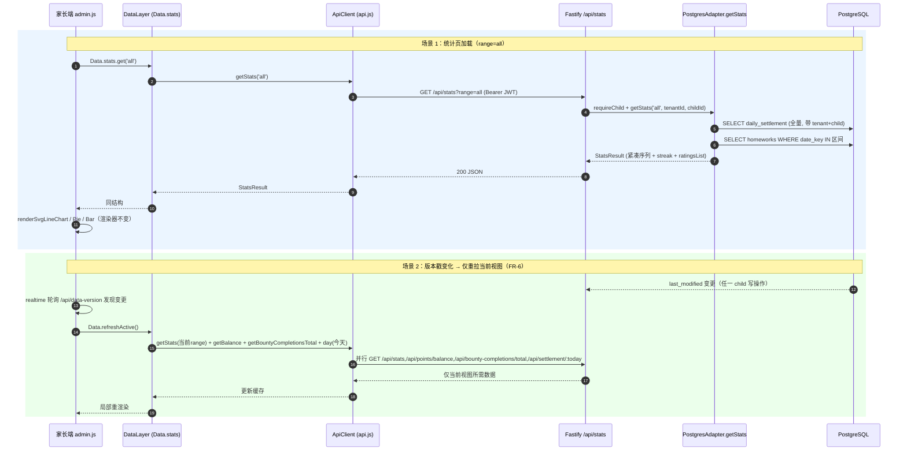
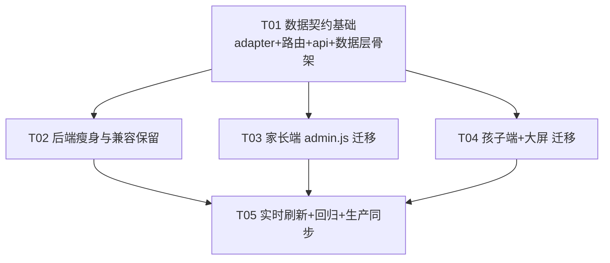

# 设计方案：客户端数据按需获取（按需索取）

> ⚠️ **状态注记（2026-07-19）**：本文为架构设计稿。截至合并 `backup/pre-rewrite-2026-07-14` 入 `main`，**对应的前端 `Data` 层（`js/data-layer.js`、`Data.refreshActive()`、`Data.init()`、`Data.day`）尚未在 `PapaCheck.Web` 代码中实现**（`data-layer.js` 在合并前 main 也不存在）。前端三端（`app.js`/`admin.js`/`big-screen.js`）实际仍使用 `API.getData()` **全量拉取 `/api/data`**。已落地并上线的仅是**后端按需端点**（`GET /api/stats`、`/api/points/balance`、`/api/bounty-completions/total`、`/api/data-version`，见 `docs/CHANGELOG.md` 的 Added 条目）。前端切换到按需端点属于**待办重构**，不在本次合并部署范围内。

- 文档版本：v1.0（架构设计稿）
- 作者：software-architect（Bob）
- 日期：2026-07-18
- 对应需求：`docs/requirement-data-on-demand.md`
- 适用范围：PapaCheck.Server（本地 Fastify 后端，含测试）、PapaCheck.Web（原生 JS 前端）。生产云函数 PapaCheck.CloudFunc 为 Server 的分离 fork，本方案在 Server 实现并测试，再按 §E.3 清单同步到 CloudFunc。

---

## A. 事实核实报告（逐条核对需求文档证据索引）

> 方法：需求文档由较弱 AI 生成，主理人要求“不可尽信”。我对表 9 + 3.1/3.2 每条证据**亲自读源码**核对。结论分三类：（1）确认无误；（2）行号/字段有出入或认知需纠正（重点）；（3）需求文档未提及但影响方案的关键事实。

### A.1 确认无误的证据

| 需求文档断言 | 核对结果 | 位置 |
|---|---|---|
| 后端 `getFullData` 全量返回、无日期过滤 | ✅ 确认 | `PapaCheck.Server/src/db/postgres-adapter.ts:375-559`；各按天查询（`homeworks` 436 / `dailySettlement` 457 / `efficiencyHistory` 478 / `freeTimeTasks` 499 / `bountySubmissions` 520 / `bountyCompletions` 541）均无 `date_key` 范围条件 |
| `points.history` 为全量流水 | ✅ 确认 | `postgres-adapter.ts:399-408` `SELECT * FROM points_history ... ORDER BY id ASC` |
| 返回结构对象（约 410-430 行） | ✅ 确认 | `postgres-adapter.ts:410-430` 的 `const data: FullDataSnapshot = {...}` |
| `renderStatsTab` 跨天遍历 `Object.keys(cachedData.dailySettlement)` | ✅ 确认 | `admin.js:1778` |
| 效率比前端现场算 `suggestedDuration/actualDuration` | ✅ 确认 | `admin.js:1793-1796` |
| 评级分布遍历 `1787-1814` | ✅ 确认 | `admin.js:1806-1814` |
| 连续全勤 `calcStreak` | ✅ 确认 | `admin.js:1861`（调用）、`1928-1949`（定义） |
| 赏金历史 `historyCounts` 遍历 | ✅ 确认 | `admin.js:1060-1101`（实际 1073-1080 构建） |
| 积分仅用 `balance` | ✅ 确认 | `admin.js:1955` |
| 大屏读取 `cachedData.dailySettlement[date]` | ✅ 确认（但见 A.2-②） | `big-screen.js:286` |
| 孩子端单日消费 + 全量 init | ✅ 确认 | `app.js:221/851/935/948` |

### A.2 需要纠正的认知（重点 —— 文档不实或可改进之处）

1. **【关键遗漏】`bountyCompletions` 被消费，但需求文档 3.1/3.4 完全未列出它。**
   - 事实：`getFullData` 确实返回 `bountyCompletions`（`postgres-adapter.ts:429`），且前端**真实消费**它：`admin.js:240` `adminBountyCompletions = cachedData.bountyCompletions || {}`，并在 `admin.js:1074` 读取 `adminBountyCompletions._total` 用于「赏金任务历史完成统计」（3.3 功能 #8）。`api.js` 的 `migrateBountyCompletionsToTotal`（409-430 行）还会把各天汇总写入 `_total`。
   - 影响：若按文档 3.4 的「未使用字段」清单去停止返回，`bountyCompletions` 会被错误丢弃，**直接破坏赏金历史统计**。
   - 决策：保留 `bountyCompletions`，但改为**按需拉取**（`GET /api/bounty-completions/total`，见 §C）。文档 3.4 表格应补 `bountyCompletions`（已消费）。

2. **【认知纠正】大屏（big-screen）是“单日”消费者，并非跨天。**
   - 事实：文档 3.2(B) 与 3.3 #9 称大屏「同样读取 `Object.keys(cachedData.dailySettlement)`（254-255 行）」「依赖多日 `dailySettlement`」。经核对，254-255 行**仅是 `console.warn` 调试日志里的 state dump**，非功能消费；功能消费只有 `getSettlementData()` 的 `cachedData.dailySettlement[Util.dateKey(currentDate)]`（286 行，仅今天），以及 `updateStats()`（`big-screen.js:1374-1380`）仅用今天的 `homeworks` 和 `cachedData.points.balance`。
   - 影响：大屏**不需要**多日历史，也不需要统计聚合端点。文档夸大了大屏的数据需求。
   - 决策：大屏迁移只需「今天 settlement + 今天 homeworks（本地变量）+ 积分余额」，无需 `/api/stats`。这大幅简化大屏改造（见 §C.2 / 任务 T04）。

3. **【字段精度】`badges` 返回的是空数组 `[]` 而非空对象 `{}`。**
   - 事实：`postgres-adapter.ts:415` `badges: (await this._getJson('badges',...)) ?? []`（空数组）；`history: {}`、`tasks: {}`（空对象）。文档 3.1/3.4 统称「返回空对象」。
   - 影响：均未被前端读取（已 grep 确认零消费点），删除安全；仅作字段类型精确标注。

4. **【方案性重大利好】点状资源的按天接口【已经存在】，需求文档对此只字未提。**
   - 事实：`api.js` 早已声明 `getHomeworks/:date`、`getSettlement/:date`、`getEfficiency/:date`、`getFreeTime/:date`、`getBountySubmissions/:date`、`getBountyCompletions/:date`；`app.ts` 也早已注册这些路由（`/api/homeworks/:date` 396、`/api/settlement/:date` 404、`/api/efficiency/:date` 449、`/api/freetime/:date` 457、`/api/bounty-submissions/:date` 471、`/api/bounty-completions/:date` 479）。
   - 影响：文档把问题框定为「只有 `/api/data` 一个全量接口」，并隐含「前端 99% 单日消费、只拉今天即可」（主理人已知此判断错误）。**真实情况**：后端「点状/配置」资源层已完整就绪，前端却仍走 `cachedData` 全量快照。因此本次重构工作量远小于文档暗示——核心缺口只有两处：(a) **缺失跨天统计聚合端点**（这是真正的难点）；(b) 需把前端从「全量快照」改接到「已存在的按需接口 + 新增聚合端点」。
   - 决策：直接复用现有按天/配置端点，不新建设施；集中力量做 (a) 聚合端点 + (b) 前端数据层解耦。

5. **【隔离强度】`requireChild` 在路由层校验 child 归属，强于文档表述。**
   - 事实：`app.ts:197-212` `requireChild` 从 JWT/query 取 `child_id`，并 `getChildById(childId, tenantId)` 校验该 child 属于本租户，否则 403 `FOREIGN_CHILD`。所有新增按 child 端点必须走 `requireChild`。
   - 影响：FR-8 / AC-6 在路由层已有硬保障；新增端点沿用即可。

6. **【版本戳粒度】`/api/data-version` 是「租户级」而非「按 child」。**
   - 事实：`getDataVersion`（`postgres-adapter.ts:1391-1403`）返回 `MAX(last_modified)|COUNT(*)`，WHERE 仅 `tenant_id`。版本戳任一 child 变更都会 bump 同租户所有端。
   - 影响：FR-6 实时刷新仍是「租户级触发 + 客户端按当前视图局部重拉」，不影响隔离（每个 child 端只重拉自己 JWT 下的资源）。

### A.3 小结

- 文档的**行号与跨天功能描述基本准确**（admin.js 统计页确为跨天消费，主理人「只拉今天即可是错误判断」的结论得到代码级确认）。
- 文档的**两处实质错误**需纠正：①遗漏已消费的 `bountyCompletions`；②夸大 big-screen 为跨天消费者（实为单日）。
- 文档**未提及已存在的按天/配置端点**——这是方案可「低风险高收益」落地的关键。

---

## B. 第 9 节 7 个开放问题的技术决策

> 全部拍板，不留「待定」。约束：不改变业务规则/积分/评级/效率比定义、不改 JWT、维持 `tenant_id`+`child_id` 隔离、功能等价（AC-2）。

### B.1 聚合计算位置 → **服务端聚合（单一聚合端点）**

- **决策**：新增单一端点 `GET /api/stats?range=week|month|all`（可选 `&from=&to=` 自定义区间，默认不需要），由服务端完成跨天统计，返回**已聚合的精简结果**。不在客户端做跨天聚合，也不拆成多个细分端点。
- **理由**：
  1. `calcStreak`（连续全勤）逻辑遍历**全部历史日期**并以最新日期为锚（`admin.js:1928-1949`），需要全量 settlement 历史；客户端若自行算就必须把历史拉下来，与 AC-1 解耦天数目标矛盾。
  2. **AC-2 功能等价**要求与现状逐字节一致。把聚合逻辑收敛到服务端单一实现，可杜绝「前端一份算法 + 未来服务端一份算法」的漂移风险，是唯一能稳定保证等价性的位置。
  3. **AC-1** 要求「30 天 vs 365 天下载量基本持平」。服务端用 SQL 日期范围过滤 + 内存聚合，只回传紧凑序列（每点仅 `{label,value}`），响应体大小与历史总天数解耦。
  4. 单端点优于多端点：减少请求数、避免多端点间聚合口径不一致。
- **不服务端化的代价**：若客户端拉「周/月」原始区间自行算，虽小但需两套算法且「总计」视图仍要全量——不可取。

### B.2 数据分层策略 → **三层契约（点状 / 聚合 / 配置）**

| 层 | 覆盖 | 接口契约 | 体量特征 |
|---|---|---|---|
| **点状资源**（FR-1） | 单日作业/结算/效率/自由时间/赏金提交/赏金完成 | 复用现有 `GET /api/{homeworks\|settlement\|efficiency\|freetime\|bounty-submissions\|bounty-completions}/:date`；新增 `GET /api/bounty-completions/total`、`GET /api/points/balance` | ∝ 当日数据量，∝̸ 历史天数 |
| **聚合资源**（FR-2/FR-4） | 统计页跨天指标 | 新增 `GET /api/stats?range=week\|month\|all` | 紧凑序列，受区间约束、∝̸ 历史天数 |
| **配置资源**（FR-3） | 商店/兑换/奖励箱/设置/赏金任务/Buff | 复用现有 `GET /api/{shop\|redemptions\|reward-box\|settings\|bounty-tasks\|active-buffs}` | 与天数无关，稳定 |
| **兼容层** | 回退 | 保留 `GET /api/data`（返回**已瘦身**快照）、`GET /api/data-version`（不变） | 见 B.6 |

### B.3 历史区间与分页 → **服务端日期范围查询，无需游标分页**

- **决策**：统计类一律服务端按 `date_key` 范围过滤（`WHERE tenant_id=$1 AND child_id=$2 AND date_key >= $3 AND date_key <= $4`）。`/api/stats` 的 `range` 解析为区间：week=最近 7 个有 settlement 的日期、month=最近 30、all=全量。
- **评级历史列表（「查看更多」）**：服务端返回**全量已评级日期列表** `ratingsList`（每项仅 `{date,rating,totalBeforeRating,multiplier,finalPoints}`，体量 ∝ 已评级天数）。多年「总计」下可能较长但单项极小；若实测超阈值再补 `?ratingLimit=N` 分页（**本期不做**，AC-2 要求「查看更多」完整可用）。
- **积分流水**：前端从不消费 `points.history`（A.1 确认），按 FR-5 **停止返回**；如未来需要，再加 `GET /api/points/history?from=&to=` 日期范围端点（本期不做）。

### B.4 未使用字段处置 → **停止返回 5 个废弃字段；保留 bountyCompletions**

| 字段 | 前端消费 | 处置 | 理由 |
|---|---|---|---|
| `points.history` | 否（仅 `balance`） | **停止返回** | FR-5；全量流水是膨胀主因之一 |
| `efficiencyHistory`（map） | 否（效率比前端现场算） | **停止返回** | FR-5；注意：per-day `GET /api/efficiency/:date` 与 `putEfficiency` **保留**（单日效率读写仍用），仅丢弃「全量 `efficiencyHistory` 映射」字段 |
| `badges` / `history` / `tasks` | 否（空 `[]`/`{}`） | **停止返回** | FR-5；零消费点（grep 确认） |
| `bountyCompletions` | **是**（赏金历史 `_total`） | **保留 + 改为按需** `GET /api/bounty-completions/total` | 文档遗漏的已消费字段（A.2-①），丢弃会破坏 3.3 #8 |

- 实施点：`getFullData` 从返回对象中剔除上述 5 字段；`/api/data` 兼容层同样返回瘦身快照（既减体积又保留回退能力）。

### B.5 实时刷新机制 → **保留版本戳轮询，重拉范围收敛到「当前视图」**

- **决策**：`/api/data-version` 轮询**原样保留**（租户级版本戳，B.1-⑥）。版本变化后，**不再全量重拉 `/api/data`**，而是由新数据层 `Data.refreshActive()` 仅重拉「当前视图所需」资源：
  - 当前视图的按天资源（今天 / admin 当前选定日）；
  - 当前统计区间 `GET /api/stats?range=<当前>`；
  - `GET /api/bounty-completions/total`、`GET /api/points/balance`；
  - 配置类（体量小且极少变）可沿用缓存、不强制重拉。
- **理由**：满足 FR-6（仅重拉所需）与 AC-4（刷新请求量不随历史天数增长）。`api.js` 写操作成功后已调用 `window._realtimeManager.bump()`（api.js:48-54）触发版本戳变化 → realtime 管理器轮询感知 → 调 `Data.refreshActive()`。`realtime.js` 基本无需改，仅确认其回调指向 `Data.refreshActive()` 而非旧的 `refreshAllData()`。

### B.6 兼容与迁移 → **保留 `/api/data` 作兼容/回退通道（标记 deprecated）**

- **决策**：**不删除** `GET /api/data`，保留为兼容层，但返回**已瘦身**快照（B.4 剔除 5 字段）。`/api/data-version` 不变。
- **迁移策略**：
  - Web 前端由我们整体部署、受控，**没有在野的旧原生客户端**依赖 `/api/data` 形状（Android/WeChat 不在本期范围，见 E.3-④）。因此「迁移」= 部署新 Web（改用按需接口）+ 保留 `/api/data` 路由。
  - **回退**：若新数据层出严重问题，git revert Web 三个文件即可回到调 `/api/data` 的旧行为，路由仍在。
  - 标记 `@deprecated` 注释，待 CloudFunc 同步且稳定一段时间后，下个大版本再考虑删除。
- **为何不全量保留旧字段做等价回退**：被剔除的 5 字段前端零消费（A.1），剔除对旧 Web 行为无影响；保留剔除反而让兼容层也变小。

### B.7 客户端数据层 → **解耦为模块化 `DataLayer`，完全替代 `cachedData` 单一快照**

- **决策**：**是**，用模块化 `DataLayer`（全局 `Data`）替代 `cachedData`。迁移范围覆盖 `admin.js`、`app.js`、`big-screen.js` + 新建 `js/data-layer.js` + 扩展 `js/api.js`。
- **结构**（详见 §C.2 / §C.3）：
  - `Data.config`：`getShopItems()/getRedemptions()/getRewardBox()/getSettings()/getBountyTasks()/getActiveBuffs()`（懒加载 + 缓存）
  - `Data.day`：`getHomeworks(d)/getSettlement(d)/getFreeTime(d)/getBountySubmissions(d)` + `set*(d,val)` 乐观写回
  - `Data.stats`：`get(range)` → `/api/stats`
  - `Data.points`：`getBalance()`
  - `Data.bounty`：`getCompletionsTotal()`
  - `Data.init()`（替代 `cachedData = await API.getData()`）、`Data.refreshActive()`（替代 `refreshAllData()` 的「全量重拉」语义）
- **迁移手法（低风险）**：
  - 全局替换读取：`cachedData.X` → 对应 `Data.*`（约 30+ 处）。
  - 6 处 `cachedData = await API.getData()`（app.js×3、big-screen.js×3）→ `await Data.init()`。
  - `admin.js:220-224` `refreshAllData()` 函数体 → `await Data.refreshActive()`（**保留函数名与约 30 个调用点不动**，仅改函数体语义，极大降低回归风险）。
  - 约 15 处写回 `cachedData.dailySettlement[dateKey]=x` → `Data.day.setSettlement(dateKey,x)`（更新本地缓存，持久化仍由现有 PUT 负责）。
  - 删除 `api.js:409-430` `migrateBountyCompletionsToTotal`（改由服务端 `_total` 聚合）。

---

## C. 架构设计

### C.1 后端（PapaCheck.Server）

#### C.1.1 新增 / 改造接口清单

| # | 方法+路径 | 入参 | 出参 schema | 隔离 |
|---|---|---|---|---|
| N1 | `GET /api/stats` | query: `range=week\|month\|all`（可选 `from`,`to` ISO 日期覆盖 range） | `StatsResult`（见 §C.3 `StatsResult`） | `requireChild` + `tenant_id`+`child_id` WHERE |
| N2 | `GET /api/points/balance` | 无 | `{ balance: number }` | `requireChild` + `tenant_id`+`child_id` |
| N3 | `GET /api/bounty-completions/total` | 无 | `{ [taskId]: number }`（聚合 `_total`） | `requireChild` + `tenant_id`+`child_id` |
| M1 | `GET /api/data`（改造） | 同前 | **瘦身** `FullDataSnapshot`（剔除 5 字段，保留 `bountyCompletions`） | 同前，`@deprecated` |

> 现有 per-day / config 端点（`/api/homeworks/:date`、`/settlement/:date`、`/efficiency/:date`、`/freetime/:date`、`/bounty-submissions/:date`、`/bounty-completions/:date`、`/shop`、`/redemptions`、`/reward-box`、`/settings`、`/bounty-tasks`、`/active-buffs`）**全部复用，不变**。

#### C.1.2 postgres-adapter 新增查询方法

- `async getStats(range | {from,to}, tenantId?, childId?): Promise<StatsResult>`
  - 隔离：`tenantId` 缺失抛错（沿用 `tenantId required` fail-fast）；查询均带 `tenant_id`+`child_id`。
  - 步骤：
    1. 取全量 settlement：`SELECT date_key, data FROM daily_settlement WHERE tenant_id=$1 AND child_id=$2`（一行/天，体积小，用于 `allDates`、streak、ratingsList、finalPoints）。
    2. 解析每个 settlement 的 `rating / finalPoints / totalBeforeRating / multiplier`。
    3. 按 `range` 解析 `dateRange`（week=末 7、month=末 30、all=全量）。
    4. 取区间 homeworks：`SELECT date_key, data FROM homeworks WHERE tenant_id=$1 AND child_id=$2 AND date_key >= $3 AND date_key <= $4`，逐日算 `totalMin`（done 且未拒作业的 `actualDuration` 之和）、`effRatio`（`round(mean(suggestedDuration/actualDuration 其中 suggested>0 且 actual!=null) * 100)`）、`dailyPoints`（`settlement.finalPoints ?? 0`）、`inSchool/atHome`（done 作业的 `completedInSchool` 计数）。
    5. 调 `getGroupMode(dateRange.length)`：`range!=='all'→'day'`；`<=31→'day'`；`<=180→'week'`；否则 `'month'`。
    6. `aggregateDaily`（mean 用于 totalMin/efficiency；sum 用于 dailyPoints）、`aggregateCompletionData`（inSchool/atHome 求和）得到序列。
    7. `ratingCounts` 计数、`ratingsList` 取有 rating 的日期倒序、`streak = calcStreak(allDates)`（**用全量 allDates，非区间**）。
    8. 汇总 `avgTotalMin / avgEffVal / totalPoints`。
  - **必须 1:1 复刻 `admin.js` 的 `getGroupMode`/`aggregateDaily`/`aggregateCompletionData`/`calcStreak`/`getWeekStart`/`formatWeekLabel`/效率比公式**，以保证 AC-2。算法详见 §E.2。
- `async getBountyCompletionsTotal(tenantId?, childId?): Promise<Record<string,number>>`
  - 复刻 `api.js:409-430` 的 `migrateBountyCompletionsToTotal` 汇总逻辑：遍历所有 `bounty_completions` 行，对每任务 id（跳过 `uuid/lastModified/isDeleted/_table/date`）累加数值（number 直接加，truthy 记 1）。
- `getFullData`（改造）：删除 `points.history`、`efficiencyHistory`、`badges`、`history`、`tasks` 的返回；保留 `bountyCompletions` 及其 `_total`（如有）。`getPointsBalance`（已存在，690 行）供 N2 复用。

#### C.1.3 路由注册位置

- 全部在 `PapaCheck.Server/src/app.ts` 的现有路由区追加（与 N1-N3 对应的 `/api/data` 同文件）：
  - N1 紧邻统计相关路由（约 404 行 `/api/settlement/:date` 之后）。
  - N2 紧邻 `/api/points` PATCH（605 行）之后，新增 `app.get('/api/points/balance', ...)`。
  - N3 紧邻 `/api/bounty-completions/:date`（479 行）之后。
  - M1 `/api/data`（380 行）保留，仅其依赖的 `getFullData` 瘦身。

#### C.1.4 是否保留 `/api/data` 兼容层

- **保留**（B.6）。返回瘦身快照 + `@deprecated` 注释。`/api/data-version` 不改。

#### C.1.5 Mermaid 时序图



### C.2 前端（PapaCheck.Web）

#### C.2.1 新数据层 `DataLayer`（新建 `js/data-layer.js`，全局 `Data`）

```js
// js/data-layer.js（伪代码骨架）
const Data = {
  _cache: { config:{}, day:{}, stats:{}, points:{}, bounty:{} },
  async init() { /* 启动：拉取落地视图所需最小集（今天 day + config + balance + 当前 stats range + bounty total） */ },
  async refreshActive() { /* 仅重拉当前视图资源（FR-6），替代 refreshAllData 的全量语义 */ },
  config: {
    async getShopItems(){ return cached('shop', ()=>API.getShopItems()); },
    // ...redemptions/rewardBox/settings/bountyTasks/activeBuffs 同构
  },
  day: {
    async getHomeworks(d){ return cached('day','hw:'+d, ()=>API.getHomeworks(d)); },
    async getSettlement(d){ return cached('day','ds:'+d, ()=>API.getSettlement(d)); },
    async getFreeTime(d){ return cached('day','ft:'+d, ()=>API.getFreeTime(d)); },
    async getBountySubmissions(d){ return cached('day','bs:'+d, ()=>API.getBountySubmissions(d)); },
    setSettlement(d,v){ this._cache.day['ds:'+d]=v; },   // 乐观写回（PUT 成功后再调）
    // setHomeworks/setFreeTime/setBountySubmissions 同构
  },
  stats: { async get(range){ return cached('stats', range, ()=>API.getStats(range)); } },
  points: { async getBalance(){ return cached('points','bal', ()=>API.getPointsBalance()); } },
  bounty: { async getCompletionsTotal(){ return cached('bounty','total', ()=>API.getBountyCompletionsTotal()); } },
};
window.Data = Data;
```

#### C.2.2 各消费点改造

- **admin.js（统计页，跨天）**：
  - `renderStatsTab()`（1775）：删除对 `cachedData.dailySettlement` / `cachedData.homeworks` 的遍历；改为 `const stats = await Data.stats.get(_statsRange);`，直接消费 `stats.totalMinutes / efficiencyRatios / dailyPoints / ratingCounts / ratingsList / completedInSchool / streak / avgTotalMin / avgEffVal / totalPoints`，渲染器（`renderSvgLineChart` 等）**保持不变**。
  - 赏金历史（1073-1080）：`historyCounts` 改读 `Data.bounty.getCompletionsTotal()`。
  - 单日作业（234）：`adminHomeworks = (await Data.day.getHomeworks(AdminUtil.dateKey(adminDate))) || []`。
  - 余额（1955）：`const balance = await Data.points.getBalance();`。
  - `refreshAllData()`（220-224）函数体改为 `await Data.refreshActive();`（**函数名与 ~30 调用点不动**）。
- **app.js（孩子端，单日）**：
  - `init()`（935）：`cachedData = await API.getData()` → `await Data.init()`；删除 `API.migrateBountyCompletionsToTotal(cachedData)`（服务端算 total）。
  - 单日读取（221/851/948）：`Data.day.getHomeworks(key)`；自由时间（852/949）：`Data.day.getFreeTime(key)`。
  - 写回（692-731/818-819 等 ~15 处 `cachedData.dailySettlement[dateKey]=x`）：`Data.day.setSettlement(dateKey, x)`。
- **big-screen.js（单日，见 A.2-②）**：
  - `getSettlementData()`（284）：`Data.day.getSettlement(Util.dateKey(currentDate))`。
  - `updateStats()`（1374）：积分改 `Data.points.getBalance()`。
  - 3 处 `cachedData = await API.getData()`（1116/1151/1262）→ `await Data.init()`。
  - **不需要** `/api/stats`（big-screen 无跨天消费）。

#### C.2.3 api.js 新增方法

- `async getStats(range)` → `GET /api/stats?range=...`
- `async getPointsBalance()` → `GET /api/points/balance`
- `async getBountyCompletionsTotal()` → `GET /api/bounty-completions/total`
- **删除** `migrateBountyCompletionsToTotal`（409-430）。
- 现有 per-day / config 方法**全部复用**，不新增。

### C.3 数据结构与接口（类图 + 接口表）

```mermaid
classDiagram
    class StatsResult {
      +string range
      +string groupMode
      +Array~{label,value}~ totalMinutes
      +Array~{label,value}~ efficiencyRatios
      +Array~{label,value}~ dailyPoints
      +Object ratingCounts
      +number ratingTotal
      +Array~{date,rating,totalBeforeRating,multiplier,finalPoints}~ ratingsList
      +Array~{label,inSchool,atHome}~ completedInSchool
      +number streak
      +number avgTotalMin
      +number avgEffVal
      +number totalPoints
    }
    class PostgresAdapter {
      +getStats(range, tenantId, childId) StatsResult
      +getBountyCompletionsTotal(tenantId, childId) Record~string,number~
      +getFullData(tenantId, childId) FullDataSnapshot$trimmed$
      +getPointsBalance(tenantId, childId) number
      +getHomeworks(date, tenantId, childId) any[]
      +getSettlement(date, tenantId, childId) any
    }
    class FastifyApp {
      +GET /api/stats(range)
      +GET /api/points/balance
      +GET /api/bounty-completions/total
      +GET /api/data /* @deprecated, trimmed */
    }
    class ApiClient {
      +getStats(range) StatsResult
      +getPointsBalance() number
      +getBountyCompletionsTotal() Record
      +getHomeworks(d) any[]
      +getSettlement(d) any
    }
    class DataLayer {
      +init() void
      +refreshActive() void
      +config: ConfigScope
      +day: DayScope
      +stats: StatsScope
      +points: PointsScope
      +bounty: BountyScope
    }
    class AdminStatsView {
      +renderStatsTab() void
    }
    PostgresAdapter ..> StatsResult : produces
    FastifyApp ..> PostgresAdapter : calls
    ApiClient ..> FastifyApp : HTTP GET
    DataLayer ..> ApiClient : uses
    AdminStatsView ..> DataLayer : reads Data.stats
    note for PostgresAdapter "所有方法带 tenantId fail-fast + tenant_id+child_id WHERE (FR-8/AC-6)"
    note for DataLayer "替代 cachedData 单一快照；refreshActive 实现 FR-6"
```

---

## D. 任务分解（有序、含依赖、≤5 任务）

> 规则遵循：不超过 5 个任务；每任务 ≥3 个相关文件；首个任务为「基础契约层」（本仓库无需新增构建配置/依赖，故基础 = 共享数据契约：adapter 方法 + 路由 + API 客户端 + 数据层骨架，后续任务均依赖它）；任务间尽量并行、避免长线性链。

### D.1 任务列表

**T01 — 数据契约基础（后端聚合方法 + 路由 + API 客户端 + 数据层骨架）** ⭐ P0
- 涉及文件：
  - `PapaCheck.Server/src/db/postgres-adapter.ts`（新增 `getStats`、`getBountyCompletionsTotal`）
  - `PapaCheck.Server/src/app.ts`（新增 `GET /api/stats`、`GET /api/points/balance`、`GET /api/bounty-completions/total`）
  - `PapaCheck.Web/js/api.js`（新增 `getStats`/`getPointsBalance`/`getBountyCompletionsTotal`，删除 `migrateBountyCompletionsToTotal`）
  - `PapaCheck.Web/js/data-layer.js`（**新建**：`Data` 模块化数据层骨架 + 缓存 + `init()`/`refreshActive()`）
- 依赖：无
- 验收：
  - `GET /api/stats?range=week|month|all` 返回结构与 `StatsResult` 一致；用一份固定 fixture（已知 homeworks/settlement）比对，服务端聚合数值与 `admin.js` 旧逐日算法**逐字段相等**（AC-2 预校验）。
  - `GET /api/points/balance` 返回数字；`GET /api/bounty-completions/total` 返回聚合 `_total` 对象。
  - 前端 `Data` 可对单日/配置/stats 懒加载并缓存；`init()`/`refreshActive()` 可调用。

**T02 — 后端瘦身与兼容保留** ⭐ P1（低风险高收益，建议紧随 T01）
- 涉及文件：
  - `PapaCheck.Server/src/db/postgres-adapter.ts`（改造 `getFullData`：剔除 `points.history`/`efficiencyHistory`/`badges`/`history`/`tasks`，保留 `bountyCompletions`）
  - `PapaCheck.Server/src/db/types.ts`（更新 `FullDataSnapshot` 类型，移除废弃字段）
  - `PapaCheck.Server/src/app.ts`（`/api/data` 标记 `@deprecated` 注释，逻辑不变；`/api/data-version` 不变）
- 依赖：T01（类型稳定后改造）
- 验收：
  - `getFullData` 响应体不再含 5 个废弃字段；`bountyCompletions` 仍在。
  - `GET /api/data` 仍可用（兼容回退）；Server 现有单测通过。

**T03 — 家长端 admin.js 迁移到按需数据层** ⭐ P0
- 涉及文件：
  - `PapaCheck.Web/js/admin.js`（统计页改读 `Data.stats`；单日作业/余额/赏金历史改读 `Data.*`；`refreshAllData()` 体改 `Data.refreshActive()`）
  - `PapaCheck.Web/js/data-layer.js`（补充 admin 所需：`stats` 缓存、`bounty.getCompletionsTotal` 接线、`day.set*` 写回）
  - `PapaCheck.Web/js/api.js`（已在 T01 扩展，本任务联调）
- 依赖：T01
- 验收：
  - 统计页 week/month/all 的「总用时/效率比/积分/评级分布/连续全勤/评级历史/在校比例」及赏金历史统计，与旧 `/api/data` 全量计算结果**完全一致**（AC-2，用脚本批量比对多组历史数据）。
  - 刷新仅拉取当前视图资源（FR-6）。

**T04 — 孩子端 app.js + 大屏 big-screen.js 迁移** ⭐ P0
- 涉及文件：
  - `PapaCheck.Web/js/app.js`（单日 homeworks/settlement/freetime 改读 `Data.day`；`init` 改 `Data.init()`；~15 处写回改 `Data.day.set*`；删除 `migrateBountyCompletionsToTotal` 调用）
  - `PapaCheck.Web/js/big-screen.js`（settlement 改 `Data.day.getSettlement(today)`；余额改 `Data.points.getBalance()`；3 处 init 改 `Data.init()`）
  - `PapaCheck.Web/js/data-layer.js`（补充 `day` 资源写回/缓存更新逻辑）
- 依赖：T01
- 验收：
  - 孩子端今日作业/结算/自由时间读写正常；大屏当日 settlement + 积分展示正常。
  - app/big-screen **不再引用全量 `cachedData`**（grep 确认无 `cachedData.dailySettlement` 等跨天全量读取残留）。

**T05 — 实时刷新最小化 + 回归测试 + 生产同步** ⭐ P1
- 涉及文件：
  - `PapaCheck.Web/js/realtime.js`（确认 bump 后回调指向 `Data.refreshActive()` 而非旧 `refreshAllData()` 全量重拉）
  - `PapaCheck.Web/js/__tests__/*`（新增/更新：stats 等价回归、data-version 刷新范围）
  - `PapaCheck.Server/src/db/postgres-adapter.ts`（新增 `getStats`/`getBountyCompletionsTotal` 单元测试）
  - `docs/design-data-on-demand.md`（附录追加 CloudFunc 同步清单，见 E.3-③）
- 依赖：T02、T03、T04
- 验收：
  - 版本戳变化后只重拉当前视图资源（FR-6 / AC-4）。
  - 同一孩子「历史 30 天」与「历史 365 天」首屏下载量基本持平（AC-1）。
  - 三端 e2e / 手动回归通过（AC-5）；隔离未被破坏（AC-6）。

### D.2 任务依赖图



### D.3 验收点汇总（对应 AC）

| AC | 验证任务 | 方式 |
|---|---|---|
| AC-1 解耦 | T05 | 30 天 vs 365 天下载量比对 |
| AC-2 跨天正确 | T01（预校验）+ T03 | 服务端聚合 vs 旧前端逐日算法逐字段比对 |
| AC-3 性能 | T05 | 长历史统计页加载耗时 |
| AC-4 实时 | T05 | 版本戳触发局部重拉 |
| AC-5 回归 | T05 | 三端 e2e/手动 |
| AC-6 隔离 | T01/T02/T03/T04 | `requireChild` + tenant+child WHERE 不变 |

---

## E. 依赖包列表 / 跨文件共享约定 / 待明确事项

### E.1 依赖包列表

- **无新增第三方依赖。**
  - 后端：沿用 Fastify + TypeScript + `pg`（PostgreSQL 驱动），不引入新框架（约束：沿用现有栈）。
  - 前端：原生 JS，沿用现有 `api.js` 模式，不引入 React/构建工具（约束：沿用原生 JS）。
  - 新增唯一实体是 `js/data-layer.js`（纯原生 JS，无依赖）。

### E.2 跨文件共享约定（Shared Knowledge）

1. **聚合算法必须 1:1 复刻 `admin.js`**，否则破坏 AC-2。服务端 `getStats` 须严格实现：
   - `getGroupMode(n)`：`range!=='all'→'day'`；`n<=31→'day'`；`n<=180→'week'`；否则 `'month'`。
   - `getWeekStart(d)`：周一为周首（与 `admin.js:1714` 同）：`new Date(d)` → `setDate(d.getDate() - ((day+6)%7))` → 取该周一 ISO 日期。
   - `formatWeekLabel`：`M/D-M/D`（月/日范围）。
   - `aggregateDaily`：day 模式 `{label:date.slice(5),value}`；week/month 按周/月聚合，`mean` 模式 `round(sum/len)`、`sum` 模式 `round(sum)`。
   - 效率比：`ratios = doneHw.filter(suggestedDuration>0 && actualDuration!=null).map(suggested/actual)`；`avgRatio = round(mean(ratios)*100)`（无有效项则 0）。
   - `calcStreak(allDates)`：用**全量** settlement 日期（非区间），从最新日期倒序，连续 `rating && rating!=='差'` 计数，未开始计数时遇无评级日期跳过、开始后遇无效即断。
   - `doneHw = hw.status==='done' && !hw.rejected`。
2. **时区一致性（重要）**：`getWeekStart` 依赖运行环境本地 `Date` 语义。Server 必须设置与浏览器一致的时区（建议部署 `TZ=Asia/Shanghai`，或租户所在时区），否则周聚合边界可能偏移 → 与旧行为不一致。见 E.3-①。
3. **隔离约定**：所有新增端点走 `requireChild(request,reply)`（校验 child 归属本租户，否则 403）；adapter 新方法首行 `if(!tenantId) throw new Error('tenantId required')`；所有 SQL 带 `tenant_id`+`child_id` WHERE。沿用现有 fail-fast 风格（FR-8/AC-6）。
4. **响应信封**：沿用现有 `sendJson(reply, payload)`，不引入新包装格式。
5. **child_id 解析**：来自 JWT `jwtPayload.child_id` 或 `?child_id=` query（`api.js` 自动附加）；`requireChild` 校验归属。
6. **刷新语义**：写操作成功后 `api.js` 调 `window._realtimeManager.bump()`（已有）→ 版本戳变化 → realtime 管理器触发 `Data.refreshActive()`（仅重拉当前视图）。

### E.3 待明确事项（Open Items）

1. **【必须确认】Server 运行时时区**：CloudBase SCF / 本地 Fastify 的 `TZ` 是否为 `Asia/Shanghai`？若 Server 为 UTC 而旧前端为中国时区，周聚合边界（周一）会偏移，导致 stats「周」视图与旧行为在跨周日期上不一致。→ 建议部署显式设置 `TZ=Asia/Shanghai`；若不可改，则需把 `getWeekStart` 改为时区无关 ISO 周（但那会改变业务呈现，属另一变更，不在本期）。
2. **「总计」评级历史长度**：`ratingsList` 在多年「总计」下可能较长（∝ 已评级天数）。默认返回全量以满足「查看更多」等价（AC-2）；若实测超阈值再补 `?ratingLimit=N` 分页（本期不做）。
3. **CloudFunc 生产同步清单**（Server 验收后执行）：
   - 将 `postgres-adapter.ts` 的 `getStats`/`getBountyCompletionsTotal`/`getFullData` 瘦身改动，port 到 `PapaCheck.CloudFunc`（确认其 adapter 方法签名一致）。
   - 将 `app.ts` 的 N1/N2/N3 路由与 `/api/data` deprecated 注释 port 过去。
   - 部署：`tcb fn deploy papacheck-api --dir dist --env-id child-teacher-parent-d9aef9d2208 --force`。
   - Web 静态资源随 `PapaCheck.Web` 一并发布；确认线上 `DataLayer` 行为一致后再观察一段时间。
4. **其他客户端消费方**：确认 `PapaCheck.Android` / `PapaCheck.WeChat` 是否直接调 `/api/data`。本期范围仅 Web+Server+CloudFunc（需求明确）；若 Android/WeChat 也调 `/api/data`，剔除 5 字段对它们无影响（零消费），但 FullData 形状变化需知会。→ 建议主理人确认无外部强依赖后再删 `/api/data`（B.6 已保留，风险可控）。
5. **`efficiencyHistory` 表数据**：确认 `efficiency_history` 表是否为空/纯历史遗留。前端从不读 `cachedData.efficiencyHistory`（grep 确认），剔除安全；若表有数据也仅影响被丢弃的冗余字段，不影响任何功能。

---

## E.4 CloudFunc 生产同步清单（T05 产出，E.3-③ 落地）

> 本清单由 QA（T05）整理，待后端验收通过后，由运维 / 主理人将 `PapaCheck.Server` 的「按需获取」改动 port 到 `PapaCheck.CloudFunc/papacheck-api`。**QA 不改动 CloudFunc，仅产出清单。**

### E.4.1 需移植的文件与改动
| # | 源（PapaCheck.Server） | 目标（PapaCheck.CloudFunc/papacheck-api） | 改动要点 |
|---|---|---|---|
| 1 | `src/db/stats.ts`（新增） | 同路径新增 | 纯函数聚合算法（getGroupMode / getWeekStart / formatWeekLabel / aggregateDaily / aggregateCompletionData / calcStreak / buildStatsFromData），1:1 复刻 admin.js，零依赖 |
| 2 | `src/db/postgres-adapter.ts` 的 `getStats` / `getBountyCompletionsTotal` | 同方法新增 | 服务端聚合；均带 `if(!tenantId) throw 'tenantId required'` fail-fast；SQL 带 `tenant_id`+`child_id` WHERE |
| 3 | `src/db/postgres-adapter.ts` 的 `getFullData` 瘦身 | 同方法改造 | 剔除 `points.history` / `efficiencyHistory` / `badges` / `history` / `tasks`，保留 `bountyCompletions`（与 Server 一致） |
| 4 | `src/db/types.ts` 的 `StatsResult` / `StatsRange` / `StatsGroupMode` / `StatsPoint` / `StatsCompletionPoint` / `RatingHistoryItem` 等 | 同类型新增 / 更新 | 契约类型，须与 Server 完全一致 |
| 5 | `src/app.ts` 的 `GET /api/stats` / `GET /api/points/balance` / `GET /api/bounty-completions/total` | 同路由新增 | 均走 `requireChild(request,reply)` 注入 tenant/child |
| 6 | `src/app.ts` 的 `GET /api/data` | 保留 + 标 `@deprecated` | 逻辑不变，仅注释标记，返回瘦身快照 |
| 7 | `GET /api/data-version` | 不变 | 租户级版本戳，沿用 |

### E.4.2 部署命令
```bash
tcb fn deploy papacheck-api --dir dist --env-id child-teacher-parent-d9aef9d2208 --force
```

### E.4.3 同步后校验
- [ ] CloudFunc 的 `getStats` 返回结构与 Server 的 `StatsResult` 字段一致（用同一份 fixture 比对）；
- [ ] CloudFunc 三端点均经 `requireChild` 校验，跨租户 / 跨 child 返回 403；
- [ ] `/api/data` 在 CloudFunc 仍可用且为瘦身快照（回退通道）；
- [ ] 部署后线上 Web 的 `DataLayer` 行为一致（先观察一段时间，确认无误再考虑下线 `/api/data`）；
- [ ] 【时区】CloudFunc 运行环境须设置 `TZ=Asia/Shanghai`（与旧前端浏览器一致，否则周聚合边界偏移，见 §E.3-①）。

### E.4.4 前提与依赖
- Server 端 T01–T05 全部验收通过（本清单假设已通过）；
- `PapaCheck.CloudFunc` 的 `postgres-adapter` 方法签名与 Server 一致（移植前须核对其 adapter 接口，若有差异需相应适配）；
- 静态前端随 `PapaCheck.Web` 一并发布。

## 附录：决策一句话总览

- 聚合→**服务端单一 `/api/stats`**；点状/配置→**复用现有按天/配置端点**；历史→**服务端日期范围**；废弃字段→**停返 5 个（保留 bountyCompletions）**；刷新→**版本戳不变 + 仅重拉当前视图**；兼容→**保留瘦身版 `/api/data` 作回退**；客户端→**`DataLayer` 替代 `cachedData`**。无需新增依赖。
